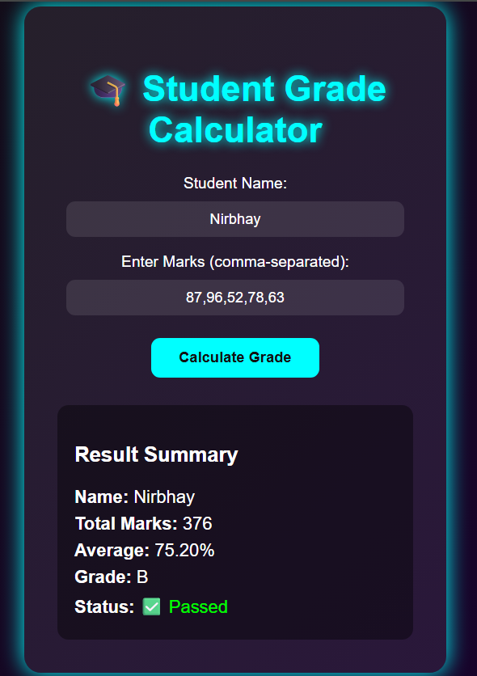

#  Student Grade Calculator Website

A simple and modern **Student Grade Calculator** built using **HTML, CSS, and JavaScript**.  
It allows users to input marks, calculate total and average, and display the final grade — all with a glowing neon-inspired design.

---

##  Features
-  Calculates total marks and average percentage  
-  Displays final grade (A, B, C, D, or F)  
-  Neon-themed responsive design  
-  Instant calculation using JavaScript  
-  Simple and interactive user interface  

---

##  Preview

---

##  Tech Stack
- **HTML5** – Structure  
- **CSS3** – Styling (Neon theme)  
- **JavaScript** – Logic and interactivity  

---

##  How to Run
1. Clone or download this repository.  
2. Open `index.html` in your browser.  
3. Enter the marks and click “Calculate Grade” to see the results.  

---

